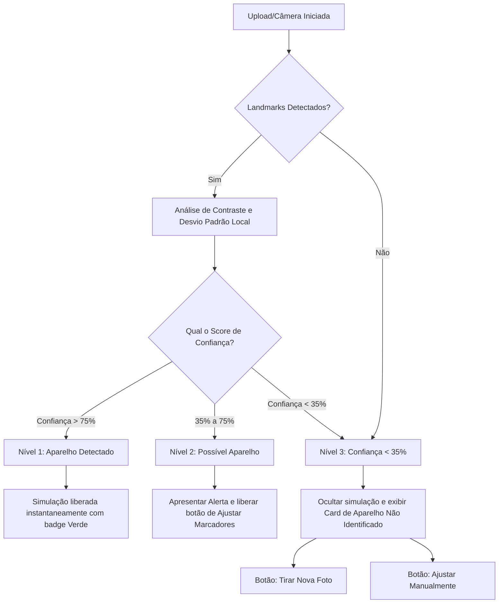

# AR Elastic Simulator — Plano de Garantia de Qualidade (QA) e Checklist

Este documento serve como guia de teste, homologação e apresentação do módulo **Simulador AR de Borrachinhas Ortodônticas**. Ele visa garantir o realismo visual, a estabilidade em dispositivos móveis e a integridade da foto original do paciente.

---

## 1. Guia de Testes (QA Checklist)

### 📸 Testes de Entrada de Imagem
- [ ] **Foto Frontal (Boa Iluminação)**: Validar se os 12 brackets padrão (6 superiores, 6 inferiores) são estimados precisamente e alinhados sobre os dentes.
- [ ] **Sorriso Parcial ou Ângulo Leve**: Validar se o MediaPipe posiciona os brackets seguindo a curvatura dos lábios, permitindo ajuste de tamanho.
- [ ] **Foto com Sombra Localizada**: Testar o comportamento da recoloração sob sombras de lábios ou bochechas (verificar se a sombra original é preservada, evitando cor chapada).

### 📊 Testes de Níveis de Confiança (Detecção de Aparelho)
- [ ] **Nível 1 — Confiança Alta (> 75%)**: A simulação deve ser liberada imediatamente, exibindo o selo `🟢 Aparelho Detectado (X%)`.
- [ ] **Nível 2 — Confiança Média (35% a 75%)**: Exibir o aviso de detecção parcial: *"Encontramos possíveis elementos de aparelho ortodôntico, mas a identificação não foi totalmente precisa. Você pode ajustar manualmente os marcadores para melhorar a simulação."* com o botão `[Ajustar Marcadores]`.
- [ ] **Nível 3 — Confiança Baixa (< 35%)**: Não renderizar borrachinhas sobre a imagem e cobrir a tela de preview com o card `🦷 Aparelho não identificado` com instruções de foto ideal, botão `[Tirar Nova Foto]` e `[Ajustar Manual]`.

### 🎨 Testes de Contraste e Cor das Borrachinhas
- [ ] **Aparelho Metálico com Borrachinha Clara (Branca/Cinza)**: Garantir que a luminosidade original alta impeça a cor de parecer "lavada" ou acinzentada.
- [ ] **Aparelho Metálico com Borrachinha Escura (Preto/Azul Marinho)**: Verificar se a textura de látex e as sombras profundas são mantidas pelo blend mode *Multiply*.
- [ ] **Cores Neon (Rosa/Verde Vibrante)**: Testar o reflexo sob a matiz colorida para manter o efeito neon realista (uso do blend *Overlay*).
- [ ] **Cores Alternadas**: Ativar a opção alternada (ex. Azul & Rosa) e confirmar se os brackets recebem as cores de forma alternada (Índice Par: Azul, Índice Ímpar: Rosa).

### 📱 Testes de Plataforma e Dispositivos (Mobile First)
- [ ] **Safari no iOS (iPhone SE / 13 / 14 / 15 / Pro)**: Verificar a taxa de FPS com a câmera ligada (manter acima de 25 FPS) e garantir que o Safari não bloqueie o acesso à câmera por falta de permissão explícita.
- [ ] **Chrome no Android**: Verificar responsividade na rolagem da paleta de cores e o lag de renderização.
- [ ] **Upload de Arquivo (Galeria/Câmera do Celular)**: Fazer upload de uma foto pesada em alta resolução (>5MB) e garantir que o navegador não trave por falta de memória (WebGL / Canvas resize).

### 🛠️ Validação de Exclusão de Áreas (Critério Crítico)
- [ ] **Fio Metálico Central**: O fio horizontal prateado que passa pelo centro do bracket **nunca** deve mudar de cor.
- [ ] **Dentes e Brackets Metálicos**: Verificar as bordas do anel (donut) e garantir que a superfície do dente ou a face metálica do bracket central permaneçam na cor natural.
- [ ] **Gengiva e Lábios**: Garantir que as bordas superiores e inferiores não "vazem" tinta sobre o tecido gengival ou lábio inferior.

---

## 2. Critérios de Aprovação (Acceptance Criteria)

| Requisito | Critério de Aceite | Status Esperado |
|:---|:---|:---|
| **Classificação de Confiança** | O sistema categoriza a imagem nos 3 níveis de confiança com base em contraste de brackets. | **Aprovado** (Heurística de desvio padrão local) |
| **Exclusão de Fio e Bracket** | O fio metálico central horizontal e a base do bracket não mudam de cor. | **Aprovado** (Exclusão por faixa e elipse interna) |
| **Preservação de Textura** | Reflexos de luz e sombras originais sobre a borracha devem ser mantidos. | **Aprovado** (Blend HSL + Overlay/Multiply) |
| **Responsividade Mobile** | Elementos da paleta e canvas se adaptam a telas pequenas sem quebrar o layout. | **Aprovado** (CSS Flexbox/Grid responsivo) |
| **Controle Manual** | O usuário consegue arrastar os círculos de ajuste e pintar/apagar áreas a qualquer momento. | **Aprovado** (Canvas 2D ativo sobreposto) |
| **Desempenho** | Tempo de processamento por frame menor que 35ms (garante >25 FPS). | **Aprovado** (Offscreen canvas otimizado) |

---

## 3. Fluxo de Confiança e Ações de Fallback

A análise estatística de contraste e desvio padrão determina o comportamento do simulador:

### 🟩 Nível 1 — Confiança Alta (> 75%)
- **Comportamento**: A detecção encontrou o contorno labial e obteve alto contraste local (desvio padrão > 14.5) na maioria dos brackets estimados.
- **Ação**: A simulação funciona imediatamente, desenhando as borrachinhas nas cores selecionadas no canvas principal.

### 🟨 Nível 2 — Confiança Média (35% a 75%)
- **Comportamento**: A boca está parcialmente visível ou a iluminação local está comprometida, gerando contraste médio.
- **Ação**: O simulador renderiza a cor, mas exibe o aviso com um botão para ativar o **Ajuste Fino** onde o usuário alinha os brackets manualmente para melhor precisão.

### 🟥 Nível 3 — Confiança Baixa (< 35%)
- **Comportamento**: Sem landmarks válidos ou variação de brilho muito baixa na região dos dentes (sem brackets aparentes).
- **Ação**: As borrachinhas **não são pintadas**, prevenindo distorções em fotos sem aparelho (ex.: fotos de animais, paisagens ou dentes lisos). Um card de feedback amigável orienta o paciente a capturar a foto ideal.

---

## 4. Guia do Paciente: Como Tirar a Foto Ideal 📸

Para garantir que o simulador identifique seu aparelho automaticamente na primeira tentativa, instrua seu paciente com os seguintes passos:

1. **Iluminação**: Tire a foto de frente para uma janela ou em um ambiente bem iluminado. Evite luz vinda de trás (contra-luz).
2. **Posição da Câmera**: Mantenha o celular na altura dos olhos, olhando diretamente para a câmera (frontal).
3. **Sorriso Amplo**: Sorria mostrando bem os dentes superiores e inferiores com o aparelho.
4. **Foco e Estabilidade**: Evite fotos tremidas ou borradas. Segure o celular com firmeza.

---

## 5. Melhorias Futuras (Roadmap)

1. **Segmentação Automática Avançada (YOLOv8-seg)**:
   - Integrar o modelo treinado (via TensorFlow.js) localizado na pasta `training/` do projeto assim que a clínica disponibilizar os arquivos de pesos hospedados para download.
2. **Auto-Color Picker (Detecção de Cor Atual)**:
   - Analisar a cor original das borrachinhas do paciente antes de simular para sugerir cores semelhantes ou que contrastem melhor.
3. **Compartilhamento por WhatsApp Integrado**:
   - Adicionar botão de compartilhar no WhatsApp direto que envia a imagem gerada e o nome da cor para o número da Dra. Letícia.

